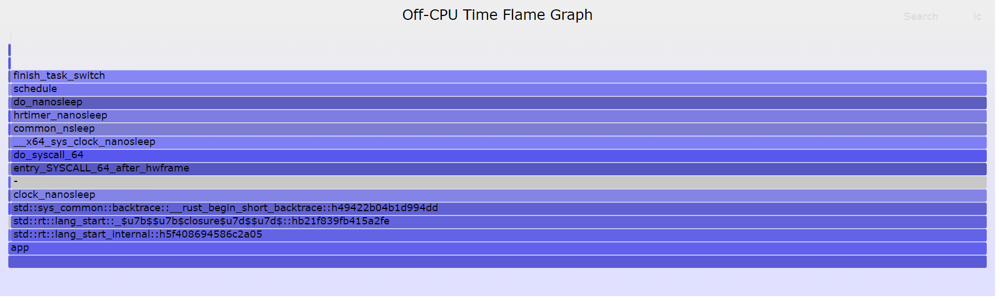

# 基于 eBPF 的 Off CPU 性能分析

## 环境
- docker 24.0.2

## 快速开始

```bash
bas play.sh
```

所得 Off-CPU 火焰图样例如下



其中，最左边的细条是关于文件读写的部分。

## 温馨提示

- `docker run` 命令的 `--pid host` 选项是必须的，否则可能会导致收集不到监控数据

## 参考文献
- [My learnings on Linux BPF container performance engineering](https://thatdevopsguy.medium.com/my-learnings-on-linux-bpf-container-performance-engineering-3eb424b73d56)
- [DatenLord | Rust程序性能分析](https://rustmagazine.github.io/rust_magazine_2021/chapter_11/rust-profiling.html)
